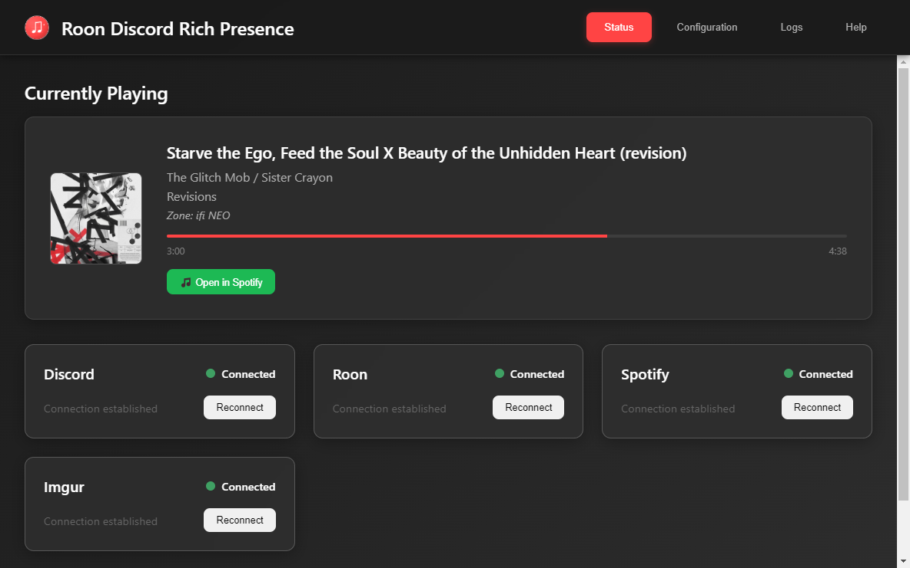
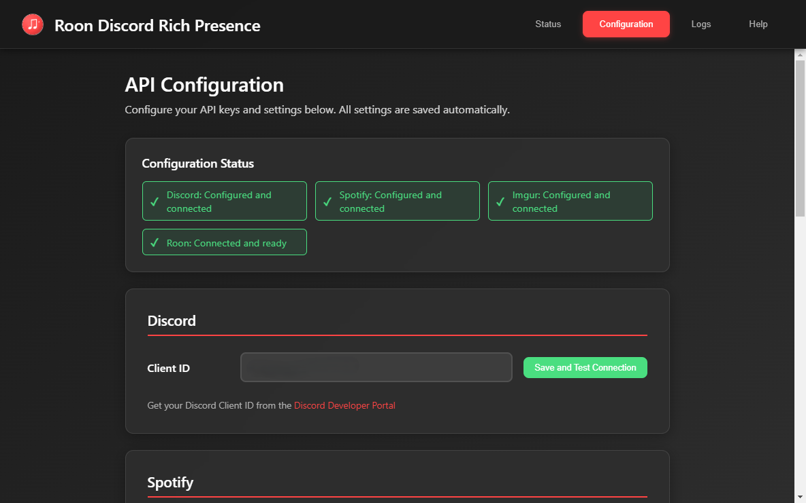
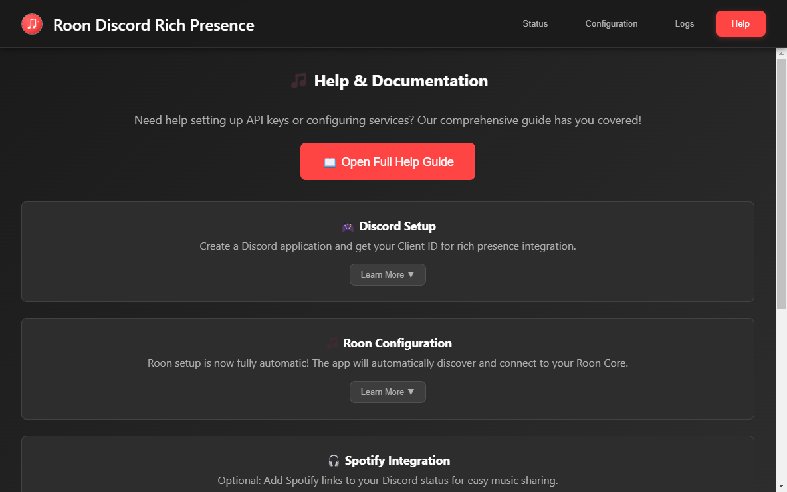
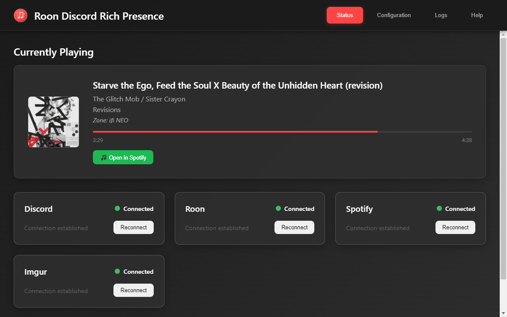
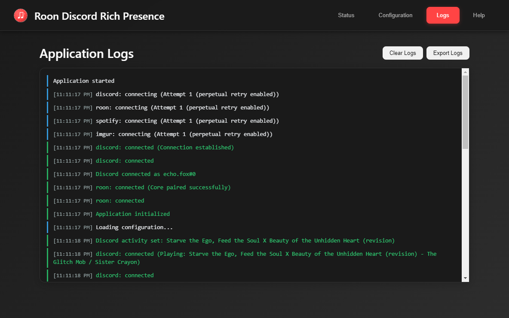

# 🎵 Roon Discord Rich Presence - GUI Edition

> **Display your Roon music in Discord with rich presence, album art, and Spotify integration**

[](https://www.gnu.org/licenses/gpl-3.0)
[](https://nodejs.org/)
[](https://electronjs.org/)



*The modern GUI interface showing connection status, currently playing track, and easy configuration access*

## 📖 Table of Contents

- [✨ Features](#-features)
- [🚀 Quick Start](#-quick-start)
- [📋 Detailed Setup Guide](#-detailed-setup-guide)
- [🎮 How It Works](#-how-it-works)
- [🔧 Advanced Configuration](#-advanced-configuration)
- [🛠️ Available Commands](#️-available-commands)
- [🐛 Troubleshooting](#-troubleshooting)
- [🏗️ Development](#️-development)

## ✨ Features

### 🎵 **Rich Discord Presence**
Show your currently playing music in Discord with beautiful album art, track information, and real-time updates.

### 🎧 **Spotify Integration**
Add "Listen on Spotify" links to your Discord activity.

### 🖼️ **Album Art Display**
Show album art in Discord and the application interface.

### 🔄 **Real-Time Updates**
Track changes and position updates are reflected in Discord.

### ⚙️ **GUI Configuration**
Configure API keys and settings through a graphical interface.

### 🔌 **Service Integration**
Connects Discord, Roon, Spotify, and Imgur services.

### 🎯 **Multi-Zone Support**
Detects and switches between multiple Roon zones.

### 🛡️ **Connection Management**
Automatic reconnection and error handling.


*Real-time service connection indicators showing Discord, Roon, Spotify, and Imgur status*

## 🚀 Quick Start

### System Requirements
- **Node.js 16.x** (Required for Roon API compatibility)
- **Discord Desktop App** (for Rich Presence display)
- **Roon Core** running on your network
- **Windows, macOS, or Linux**

### 1. Download & Install

#### Option A: Use the Executable (Recommended)
1. Download the latest release from the [Releases page](https://github.com/your-username/roon-discord-publish/releases)
2. Extract the files to a folder
3. Run `roon-discord-gui.exe` (Windows) or the equivalent for your platform

#### Option B: Run from Source
```bash
# Clone the repository
git clone https://github.com/your-username/roon-discord-publish.git
cd roon-discord-publish

# Set up local Node.js 16.x (included with the project)
npm run setup-local-node

# Install dependencies
npm install

# Run the GUI application
npm run electron
```

### 2. Initial Setup

1. **Launch the application** - The GUI will open automatically
2. **Enable in Roon** - Go to "Extensions" in your Roon client and enable "Discord Rich Presence"
3. **Configure Discord** - Follow the setup guide in the Configuration tab
4. **Verify connection** - Check that all services show "Connected" status


*Application successfully running with services connecting and track information displayed*

## 🖼️ Application Interface

The application features a clean, tabbed interface with four main sections:

| Status Tab | Configuration Tab |
|------------|-------------------|
|  |  |
| *Monitor service connections and now playing* | *Configure API keys and settings* |

| Logs Tab | Help Tab |
|----------|----------|
|  |  |
| *View application logs and debugging info* | *Access help and documentation* |

## 📋 Detailed Setup Guide

### Discord Application Setup

1. **Create Discord Application**:
   - Go to [Discord Developer Portal](https://discord.com/developers/applications)
   - Click "New Application"
   - Give it a name (e.g., "My Music Bot")
   - Copy the **Application ID**

2. **Configure in App**:
   - Open the Configuration tab
   - Paste the Application ID into "Discord Client ID"
   - Click "Save Configuration"


*The configuration interface where you enter API keys for Discord, Spotify, and Imgur*

### Spotify Integration (Optional)

Adds "Listen on Spotify" links to your Discord activity:

1. **Create Spotify App**:
   - Go to [Spotify Developer Dashboard](https://developer.spotify.com/dashboard)
   - Click "Create App"
   - Fill in app details
   - Copy **Client ID** and **Client Secret**

2. **Configure in App**:
   - Enter credentials in the Configuration tab
   - Save configuration

### Imgur Integration (Optional)

For hosting album art when direct image links aren't available:

1. **Create Imgur App**:
   - Go to [Imgur API Registration](https://api.imgur.com/oauth2/addclient)
   - Register as "Anonymous usage without user authorization"
   - Copy the **Client ID**

2. **Configure in App**:
   - Enter Client ID in the Configuration tab
   - Save configuration

## 🎮 How It Works

### Discord Rich Presence Display

Your Discord profile will show:
- **🎵 Track Title** - Currently playing song
- **👤 Artist Name** - Song artist(s)
- **💿 Album Name** - Album information
- **🖼️ Album Art** - High-quality album artwork
- **🎧 Spotify Link** - "Listen on Spotify" button (if configured)
- **⏱️ Progress** - Real-time playback position
- **🏠 Zone** - Which Roon zone is playing

### Real-Time Updates

The application automatically detects:
- **Track changes** (manual or automatic)
- **Playback position** (updated every 2 seconds)
- **Zone switching** (when you change Roon zones)
- **Play/pause states** (updates Discord accordingly)



*The application automatically attempts to connect to all configured services*

## 🔧 Advanced Configuration

### System Tray Integration
- **Minimize to tray** - Keep running in background
- **Auto-start** - Launch with system startup
- **Quick controls** - Right-click tray icon for options

### Connection Management
- **Auto-reconnect** - Automatic retry with exponential backoff
- **Manual reconnect** - Force reconnection via Services menu
- **Status monitoring** - Visual indicators for all services

### Logging & Debugging
- **Built-in log viewer** - Check the Logs tab for troubleshooting
- **Debug mode** - Run with `npm run electron-dev` for detailed logs
- **Test commands** - Use `npm run test:*` scripts for diagnostics



*Built-in log viewer for troubleshooting and monitoring application activity*

## 🛠️ Available Commands

### GUI Application
```bash
npm run electron          # Run the GUI application
npm run electron-dev      # Run with developer tools
npm run build            # Build distributable packages
```

### Development & Testing
```bash
npm run setup-local-node    # Download local Node.js 16.x
npm run test:screenshots    # Capture application screenshots
npm run test:integration    # Run integration tests
npm run clean              # Clean build artifacts
```

## 🐛 Troubleshooting

### Common Issues

#### Discord Not Showing Activity
- ✅ Check Discord Client ID is correct
- ✅ Ensure Discord desktop app is running
- ✅ Verify Discord privacy settings allow Rich Presence
- ✅ Try restarting both Discord and this app

#### Roon Connection Failed
- ✅ Ensure Roon Core is running and accessible
- ✅ Check that extension is enabled in Roon Extensions
- ✅ Verify network connectivity between devices
- ✅ Try the "Reconnect All" option in Services menu

#### Node.js Version Issues
- ❌ **"TypeError: this.ws.on is not a function"** - You're using Node.js 17+
- ✅ **Solution**: Use Node.js 16.x or run `npm run local` for local Node.js

#### Configuration Issues
- ❌ **"config.json not found"** - Configuration file missing
- ✅ **Solution**: Use the GUI Configuration tab or copy `config.example.json`

### Getting Help

1. **Check the Logs tab** in the application for error details
2. **Run diagnostics**: `npm run debug:diagnostics`
3. **Create an issue** on GitHub with logs and system info
4. **Join the community** for support and discussions


*Built-in help and documentation accessible from the Help tab*

## 🏗️ Development

### Building from Source
```bash
git clone https://github.com/your-username/roon-discord-publish.git
cd roon-discord-publish
npm install
npm run electron-dev
```

### Running Tests
```bash
npm run test:integration    # Integration tests
npm run test:workflow      # E2E workflow tests
npm run test:screenshots   # Screenshot capture
```

### Contributing
1. Fork the repository
2. Create a feature branch
3. Make your changes
4. Add tests if applicable
5. Submit a pull request

## 📄 License

This project is licensed under the GPL-3.0 License - see the [LICENSE](LICENSE) file for details.

## 🙏 Acknowledgments

Based on implementations by:
- **615283 (James Conway)** - Original concept
- **williamtdr** - Core functionality
- **jaredallard** - Additional features

## 🔗 Links

- [GitHub Repository](https://github.com/your-username/roon-discord-publish)
- [Issue Tracker](https://github.com/your-username/roon-discord-publish/issues)
- [Roon Labs](https://roonlabs.com/)
- [Discord Developer Portal](https://discord.com/developers/applications)

---

**Made with ❤️ for the Roon and Discord communities**